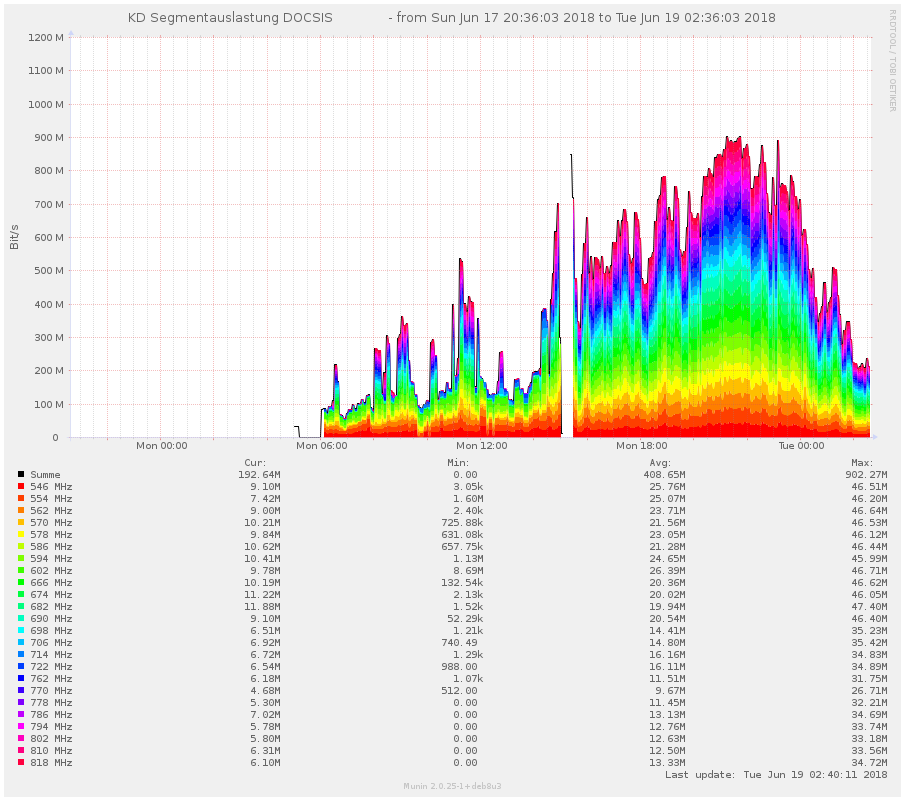

EuroDOCSIS 3.0 Segment utilization monitoring
=============================================

This set of bash scripts allows to monitor bandwidth utilization on a EuroDOCSIS 3.0 TV cable segment and natively supports Munin.
All further mentions of DOCSIS actually refer to EuroDOCSIS 3.0.
Initial idea from [https://github.com/plenet/munin-plugins/blob/master/kdgsegments]

# Dependencies
- Bash >= 4.0
- bc
- dvb-fe-tool
- dvbtune
- dvbsnoop

The corresponding Debian packages are:

- bash
- bc
- dvb-tools
- dvbtune
- dvbsnoop

# Installing

## Tools
The measurement tools is comprised of multiple parts. Just copy all files from ```bin``` to ```/usr/local/bin``` or another suitable location.

## Cron/Timer
The script ```segmentinfo_munin``` can be run as a cron to measure the current segment utilization. This is necessary since measuring can take
quite a long time (~4.5 minutes). The systemd unit and timer ```segmentinfo.service``` and ```segmentinfo.timer``` can be copied to ```/etc/systemd/system``` and enabled to
update the utilization database.

## Munin plugin
Just create a symlink from ```segmentinfo_munin``` into your munin plugin directory. The plugin must be run as root (which is the default).


# Usage

I've tested this software with the Astrometa DVB-T/T2/C stick (15f4:0131).

## segmentinfo_freq
Tool to measure the utilization of a single DOCSIS channel
```
segmentinfo_freq [-a <adapterid>] [-f <frontendid>] [-t <sampling time>] [-n] <frequency>
```


## segmentinfo
Tool to measure utilization on multiple DOCSIS channels
```
segmentinfo [-a <adapter>] [-t <sampling time>] [-n] [frequency ...]

The format of the adapter specification is '<adapterid>.<frontendid>'

If you have multiple DVB-C adapters available you can connect up to 4 sticks and specify the option '-a' multiple times to use them all.
```

## segmentinfo_munin
Munin plugin and data update tool. Runs as a cron to prepare
utilization data and delivers it when executed as a munin plugin.
Configuration is specified at the beginning of the file.

```
segmentinfo_munin <config|fetch|update>

update: Update frequency/utilization database
config: Output munin plugin config
fetch: Output munin plugin data (anything but 'update' and 'config' will trigger this behaviour)

```

## Munin graph example
The picture below shows a graph generated by this munin plugin. Don't worry about the blank spots, I've just not given it enough time to populate fully.


